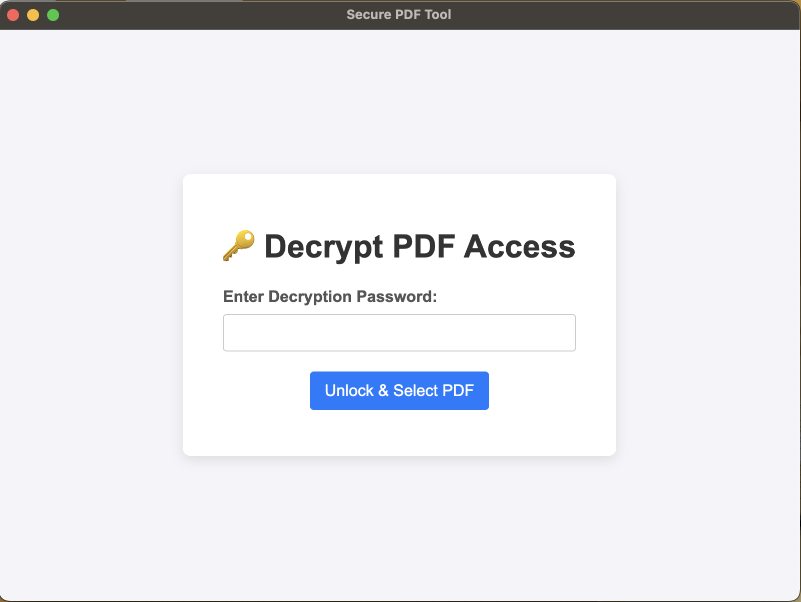
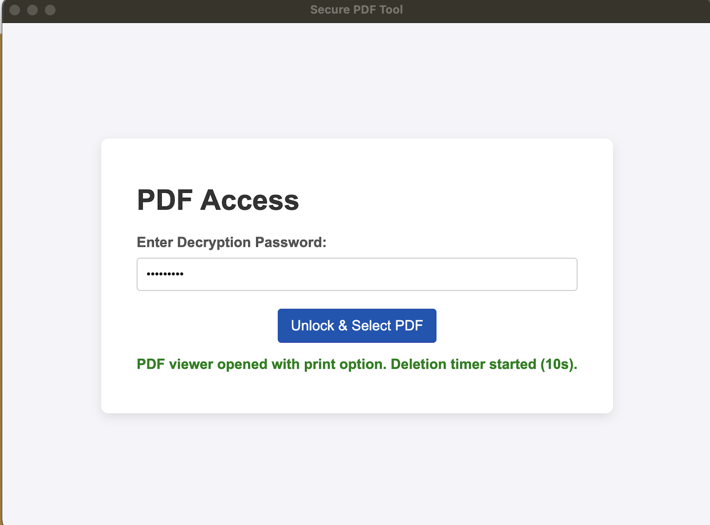
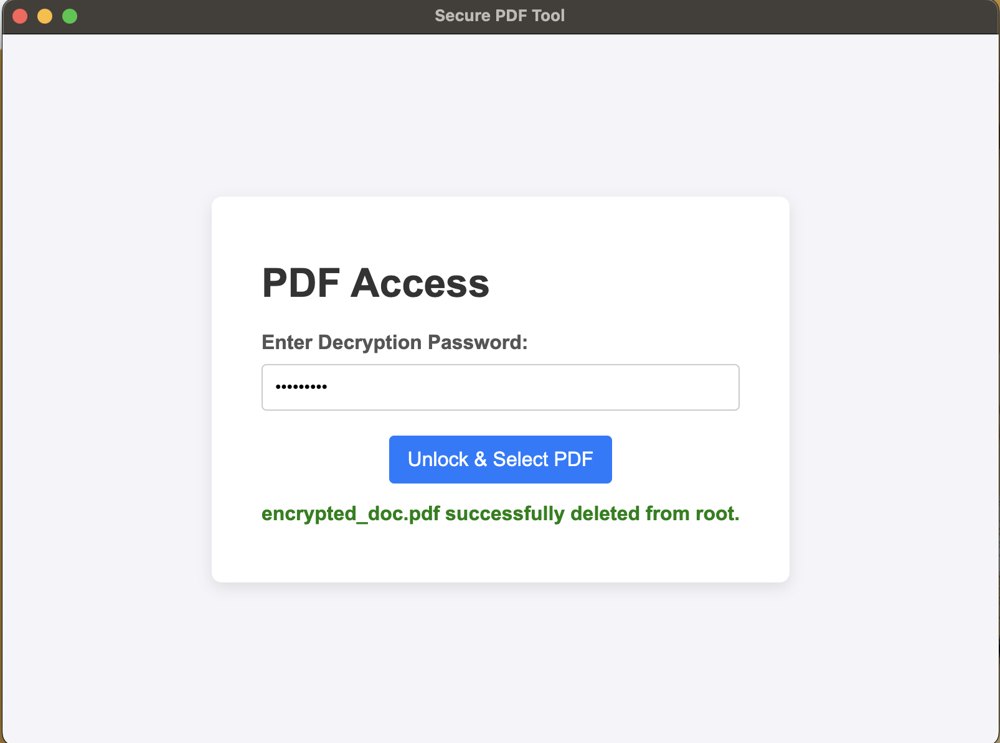

# 📄 Secure PDF Viewer & Self-Destruct Utility

This is an Electron application designed for the secure, temporary viewing and printing of a single, sensitive PDF file. After the access purpose is served, the source PDF file is automatically and permanently deleted from the local system. 

## 🌟 Key Features

* **Password Protected Access:** Requires a hardcoded password (`secure123`) for initial access via the main HTML interface.
* **Secure Viewing & Printing:** Loads PDF content using the external **PDF.js** library in a dedicated window, configured for minimal toolbar options to encourage print-only usage.
* **Anti-Capture Measures:** Implements native operating system features (`setContentProtection`) and global key handlers (`PrintScreen`) to deter unauthorized screenshots while the viewer is active.
* **Idle Timeout Security:** Utilizes the Electron `powerMonitor` to detect inactivity. If the system is idle for **30 seconds**, the viewer window automatically closes to secure the content.
* **Self-Destruct Logic:** The source PDF file (`encrypted_doc.pdf`) is **permanently deleted** from the project root using Node.js's `fs.unlink()` after **10 seconds** of successful access.

## 🛠️ Installation and Setup

### Dependencies

This project requires **Node.js** and **npm** (Node Package Manager).

| Dependency | Purpose |
| :--- | :--- |
| `electron` | The core framework for building the desktop application. |
| `pdf.js` (External) | Third-party library required for secure PDF rendering. |
| `electron-packager` | Tool used to package the Electron application into distributable executables (EXE, DMG, etc.). |

### Project Structure

Your final directory structure **must** look like this for the application to function:

add your pdf document encrypted_doc.pdf in root that needs to be displayed and deleted

electron-pdf-tool/ <br>
├── encrypted_doc.pdf    <-- CRITICAL: Your target file to be deleted <br>
├── main.js              <-- Main Process (Logic, Timer, Deletion)    <br>
├── preload.js           <-- Secure IPC Bridge  <br>
├── index.html           <-- Main Application UI (Password input)  <br>
├── package.json         <-- Project metadata and scripts   <br>
├── web/                 <-- PDF.js Viewer files (Contains viewer.html)  <br>
└── build/               <-- PDF.js core rendering files  <br>


### Step-by-Step Setup

1.  **Initialize Project:**
    ```bash
    mkdir electron-pdf-tool
    cd electron-pdf-tool
    npm init -y
    ```
2.  **Install Electron and Packager:**
    ```bash
    npm install electron electron-packager --save-dev
    ```
3.  **Download PDF.js:**
    * Manually download the latest **pre-built** version of PDF.js.
    * Extract and copy the **`web`** and **`build`** folders into your `electron-pdf-tool` directory.
4.  **Add Source File:**
    * Place your target PDF file into the root folder and ensure it is named **`encrypted_doc.pdf`**.
5.  **Populate Files:**
    * Ensure `main.js`, `preload.js`, and `index.html` contain the final, correct code (including the file deletion logic and the "close on idle" feature).
    * **Note:** `web/viewer.html` should be cleaned of all custom lock-screen code.

### Commands to Run

1.  **Start the Application (Development Mode):**
    ```bash
    npm start
    ```
    (Requires: `"start": "electron ."` in `package.json`).

---

## 📦 Bundling into an Executable (EXE)

### Step 1: Add Package Script

Open your `package.json` file and add the packaging command under `"scripts"`:

```json
"scripts": {
    "start": "electron .",
    "package-win": "electron-packager . 'SecurePDF' --platform=win32 --arch=x64 --overwrite --out=dist --ignore=node_modules/electron/",
    "package-mac": "electron-packager . 'SecurePDF' --platform=darwin --arch=x64 --overwrite --out=dist --icon=./icon.icns"
},
```


### Step 2: Run the Package Command
Execute the script to build your EXE (Windows example):

```bash
npm run package-win
```

This command creates a distributable folder inside a new directory named dist. The final executable (SecurePDF.exe) will be located inside the platform-specific subfolder (e.g., dist/SecurePDF-win32-x64/).


```bash
npm run package-mac
```
This command creates a distributable folder inside a new directory named dist. The final executable (SecurePDF.exe) will be located inside the platform-specific subfolder (e.g., dist/SecurePDF-darwin-x64/SecurePDF.app
).


## Screenshot









That's an excellent project and a perfect topic for a LinkedIn post! I will rephrase and expand your content to make it more engaging, professional, and highlight the technical achievements and future vision.

Here is the draft for your LinkedIn post:

---

## 🚀 LinkedIn Post Draft

### **Hook**

Hello Connections! 👋 It's been a while, but I'm excited to share a personal Security Engineering challenge I recently tackled with a new project.

### **The Problem (The "Why")**

When sharing sensitive PDF documents, existing solutions often fall short on genuine control and security:

1.  **Simple Password Protection:** You risk potential password theft, and the recipient retains the file forever.
2.  **Online Document Tools:** They rely heavily on constant internet connectivity and browser security, which is often out of your control on the client's side.

I realized there was a critical gap: **No easy, offline solution exists for securely delivering an encrypted, self-destructing document with strong anti-capture measures.** 

### **The Solution (The "How" & The Tech)**

To solve this, I built a custom desktop application using **Node.js** and **Electron**, wrapped the encrypted PDF, and bundled it into a single executable viewer.

Here’s what the solution implements:

* 🔒 **Zero-Trust Delivery:** The PDF is only viewable after a password check.
* 💣 **Self-Destruct Timer:** The source PDF file is **permanently deleted** from the user's local system after a fixed 10-second viewing window.
* 🚫 **Anti-Capture Measures:** I utilized Electron's native OS features (`setContentProtection`) and global key handlers to actively block common screenshot methods.
* 😴 **Idle Timeout:** The viewer closes automatically after 30 seconds of user inactivity.
* 🖨️ **Print-Only Mode:** The viewer is stripped of download/save options, focusing the user solely on printing.

### **Call to Action & Next Steps**

This project has been a great exercise in applying low-level system security controls within a high-level framework.

My next step is to integrate **AI/ML** for enhanced security, specifically working on **anomaly detection** to spot suspicious user behavior (e.g., rapid scrolling, automated interactions) and shut down the viewer instantly. 

I would love to hear your thoughts on this approach to secure content delivery!

\#SoftwareDevelopment \#NodeJS \#ElectronJS \#SecurityEngineering \#Cybersecurity \#PersonalProject \#SelfDestructingDocs